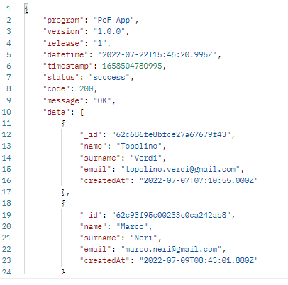
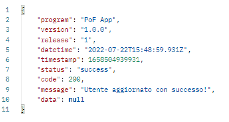
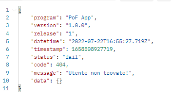
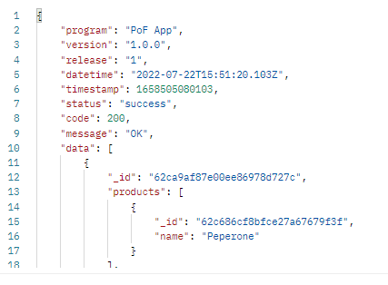
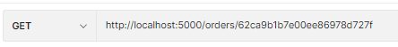
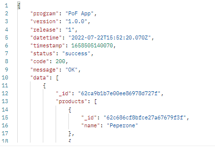
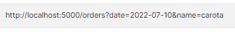
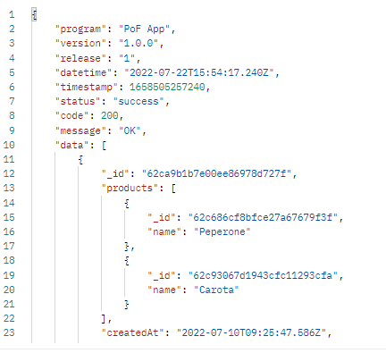
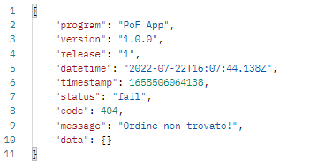
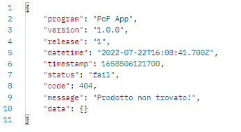

# ABOUT THE PROJECT

The goal of this application is to implement RESTful JSON APIs that will enable the management of purchasing groups.

(<a href="#top">back to top</a>)

# DESCRIPTION

The user through the use of our backend will be able to make api calls to our service so that they can add, edit, delete and update products, customers and orders.

(<a href="#top">back to top</a>)

# HOW TO USE THE APPLICATION

The application does not have any front-end, in order to be able to view, add, update and delete data it is advisable to use the service offered by Postman.

The back-end provide for the use of three paths for data manipulation:

1. Products;
2. Users;
3. Orders.

(<a href="#top">back to top</a>)

## PRODUCTS

To perform manipulation of product data you will need to make requests at the following link:

### POST

To add a new product you will need to use the following schema:

### GET

 Requests for product display will be able to be made generically:

 
  
Result:

 or specific using (if you know) the id of the product:

 

 Result:
 

### PATCH

In order to make the request to edit a product, you will first need to know its ID:
The pattern will be the same as that of a POST call.

If successful, the following message will be displayed:

In case of an error this message will be displayed:

### DELETE

To be able to carry out the deletion of a product it will be enough to know only its ID:

Display if successful:

Display in case of error:

(<a href="#top">back to top</a>)

## USERS

To carry out manipulation of product data, requests will need to be made at the following link:

### POST

To add a new user you will need to use the following scheme:

### GET

 Requests for viewing users will be able to be made generically:
 
 
 
Result:

 or specific using (if you know) the user id:
 

Result:

### PATCH

In order to make the request to edit a user, you will first need to know the user's id:
The pattern will be the same as that of a POST call.

If successful, the following message will be displayed:

In case of an error this message will be displayed:

### DELETE

In order to be able to carry out the deletion of a user it will be enough to know only his ID:
Display in case of success:

Display in case of error:

(<a href="#top">back to top</a>)

## ORDERS

To carry out manipulation of order data, requests will need to be made at the following link:

### POST

To add a new user you will need to use the following scheme:

### GET

 Requests for displaying products may be made generically or using the date and name filter:

 1. GENERIC

 

 Result:

 

 1. SPECIFY

 Or specify using (if you know) the product id.

 

Result:

 

 Display in case of error:

3. USING THE FILTER

Result:

Display in case of error:

### PATCH

In order to make the request to the modification of a product, we will first need to know its ID.
The pattern will be the same as that of a POST call.

If successful, the following message will be displayed:

In case of an error this message will be displayed:

### DELETE

To be able to carry out the deletion of a product it will be enough to know only its ID:
Display if successful:

Display in case of error:

(<a href="#top">back to top</a>)

## APPLICATION DEPENDENCIES

### CORS

CORS is a node.js package for providing a Connect/Express middleware that can be used to enable CORS with various options.

### DOTENV

Dotenv is a zero-dependency module that loads environment variables from a .env file into process.env. Storing configuration in the environment separate from code is based on The Twelve-Factor App methodology.

### EXPRESS

Fast, unopinionated, minimalist web framework for node.

### MONGOOSE

Mongoose is a MongoDB object modeling tool designed to work in an asynchronous environment. Mongoose supports both promises and callbacks.

(<a href="#top">back to top</a>)

 ## CONTACTS

Email: [gennuso.biagio@gmail.com](mailto:gennuso.biagio@gmail.com)

Github: [PoF](https://github.com/bilabixxx/pof)

(<a href="#top">back to top</a>)
